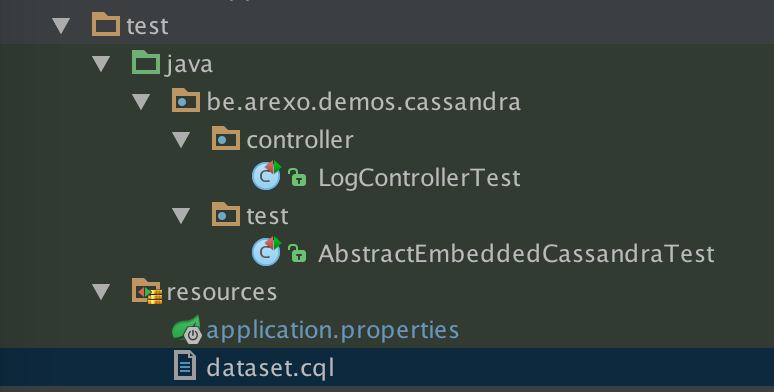

# Write integration tests with Spring Boot and Cassandra in 2 minutes


### Context
The following document will describe an how-to write integration tests with Spring-Boot against an embedded Cassandra database with the use of cassandra-unit framework.
To achieve this, I wrote a little and basic log management application. This mainly focused on writing a test and validated what is retrieved from the database.

### Cassandra-unit
Cassandra-unit, as indicated by its name, is a unit testing library wich add to your test the ability to start/stop a Cassandra database server and also inject a CQL dataset into it.

The project provides two modules:
- **cassandra-unit** : the core, contains everything to start the server, injection of dataset etc...
- **cassandra-unit-spring** : A library which fill the gap between Spring-Boot dependency injection and the Cassandra related stuff. The second ones include the first.

More info on the project [GitHub's page](https://github.com/jsevellec/cassandra-unit)

### Configure your project
For this example, I used Gradle as building management system, add the following depedencies to your build.gradle file
```
ext {
    springBootVersion = '1.3.5.RELEASE'
}

dependencies {
    compile("org.springframework.boot:spring-boot-starter-web:${springBootVersion}")

    compile("org.springframework.boot:spring-boot-starter-data-cassandra:${springBootVersion}")

    compile("com.datastax.cassandra:cassandra-driver-core:2.1.7.1")
    compile("com.datastax.cassandra:cassandra-driver-dse:2.1.7.1")

    testCompile("org.springframework.boot:spring-boot-starter-test:${springBootVersion}")
    testCompile('org.cassandraunit:cassandra-unit-spring:2.2.2.1')
}
```


### Write a dataset
Create a dataset file, the CQL instruction present in that file will be played against the database which is loaded within your test


The "dataset.cql" file
```
CREATE KEYSPACE IF NOT EXISTS mykeyspace WITH replication = {'class': 'SimpleStrategy', 'replication_factor': '1'}  AND durable_writes = true;

DROP TABLE IF EXISTS mykeyspace.logs;

CREATE TABLE IF NOT EXISTS mykeyspace.logs (
    id text,
    query text,
    PRIMARY KEY (id)
);


INSERT into mykeyspace.logs(id, query) values ('1','cinema');
```

### Write a test
```java
package be.arexo.demos.cassandra.controller;
 
import be.arexo.demos.cassandra.test.AbstractEmbeddedCassandraTest;
import org.cassandraunit.spring.CassandraDataSet;
import org.junit.Test;
import org.springframework.http.HttpStatus;
import org.springframework.http.ResponseEntity;

import static org.hamcrest.core.Is.is;
import static org.junit.Assert.assertEquals;
import static org.junit.Assert.assertThat;
 
@CassandraDataSet(keyspace = "mykeyspace", value = {"dataset.cql"})
public class LogControllerTest extends AbstractEmbeddedCassandraTest {
 
    @Test
    public void testFindOne() throws Exception {
 
        ResponseEntity<Log> response = client.getForEntity("/logs/{id}", Log.class, 1);
 
        assertThat(response.getStatusCode()     , is(HttpStatus.OK));
        assertThat(response.getBody().getQuery(), is("cinema"));
    }
}
```



The annotation @CassandraDataSet is used to define the keyspace to use and also the sql requests to load into the database

### Go further and create an abstract test class
```java
package be.arexo.demos.cassandra.test;

import be.arexo.demos.cassandra.DemoApplication;
import org.cassandraunit.spring.CassandraUnitDependencyInjectionTestExecutionListener;
import org.cassandraunit.spring.EmbeddedCassandra;
import org.junit.runner.RunWith;
import org.springframework.beans.factory.annotation.Value;
import org.springframework.boot.test.SpringApplicationConfiguration;
import org.springframework.boot.test.TestRestTemplate;
import org.springframework.boot.test.WebIntegrationTest;
import org.springframework.test.context.TestExecutionListeners;
import org.springframework.test.context.junit4.SpringJUnit4ClassRunner;
import org.springframework.test.context.support.DependencyInjectionTestExecutionListener;
import org.springframework.web.client.RestTemplate;
import org.springframework.web.util.DefaultUriTemplateHandler;

import javax.annotation.PostConstruct;

@RunWith(SpringJUnit4ClassRunner.class)
@SpringApplicationConfiguration(classes = DemoApplication.class)
@WebIntegrationTest(randomPort = true) // Pick a random port for Tomcat
@TestExecutionListeners(listeners = {
        CassandraUnitDependencyInjectionTestExecutionListener.class,
        DependencyInjectionTestExecutionListener.class}
)
@EmbeddedCassandra(timeout = 60000)
public class AbstractEmbeddedCassandraTest {

    @Value("${local.server.port}")
    protected int port;

    @Value("${test.url}")
    protected String url;

    protected RestTemplate client;

    @PostConstruct
    public void init() {
        DefaultUriTemplateHandler handler = new DefaultUriTemplateHandler();
        handler.setBaseUrl(url + ":" + port);
        handler.setParsePath(true);

        client = new TestRestTemplate();
        client.setUriTemplateHandler(handler);
    }
}
```

### Conclusion
That 's all, as you can see, writing integration test with an embedded cassandra database is not so difficult.
With this code, you have and ready to go example. I hope you enjoy this article.


### troubleshooting

if you got this ...
```java
java.lang.NoSuchMethodError: com.codahale.metrics.Snapshot: method <init>()V not found
	at com.codahale.metrics.UniformSnapshot.<init>(UniformSnapshot.java:39) ~[metrics-core-3.1.0.jar:3.0.2]
	at org.apache.cassandra.metrics.EstimatedHistogramReservoir$HistogramSnapshot.<init>(EstimatedHistogramReservoir.java:77) ~[cassandra-all-2.2.2.jar:2.2.2]
	at org.apache.cassandra.metrics.EstimatedHistogramReservoir.getSnapshot(EstimatedHistogramReservoir.java:62) ~[cassandra-all-2.2.2.jar:2.2.2]
	at com.codahale.metrics.Histogram.getSnapshot(Histogram.java:54) ~[metrics-core-3.0.2.jar:3.0.2]
	at com.codahale.metrics.Timer.getSnapshot(Timer.java:142) ~[metrics-core-3.0.2.jar:3.0.2]
	at org.apache.cassandra.db.ColumnFamilyStore$3.run(ColumnFamilyStore.java:435) ~[cassandra-all-2.2.2.jar:2.2.2]
	at org.apache.cassandra.concurrent.DebuggableScheduledThreadPoolExecutor$UncomplainingRunnable.run(DebuggableScheduledThreadPoolExecutor.java:118) ~[cassandra-all-2.2.2.jar:2.2.2]
	at java.util.concurrent.Executors$RunnableAdapter.call(Executors.java:511) [na:1.8.0_25]
	at java.util.concurrent.FutureTask.runAndReset(FutureTask.java:308) [na:1.8.0_25]
	at java.util.concurrent.ScheduledThreadPoolExecutor$ScheduledFutureTask.access$301(ScheduledThreadPoolExecutor.java:180) [na:1.8.0_25]
	at java.util.concurrent.ScheduledThreadPoolExecutor$ScheduledFutureTask.run(ScheduledThreadPoolExecutor.java:294) [na:1.8.0_25]
	at java.util.concurrent.ThreadPoolExecutor.runWorker(ThreadPoolExecutor.java:1142) [na:1.8.0_25]
	at java.util.concurrent.ThreadPoolExecutor$Worker.run(ThreadPoolExecutor.java:617) [na:1.8.0_25]
	at java.lang.Thread.run(Thread.java:745) [na:1.8.0_25]

```

Exclude from the configuration de *com.codahale.metrics* dependency
```gradle
configurations {
	all*.exclude group: 'com.codahale.metrics'
}
```
